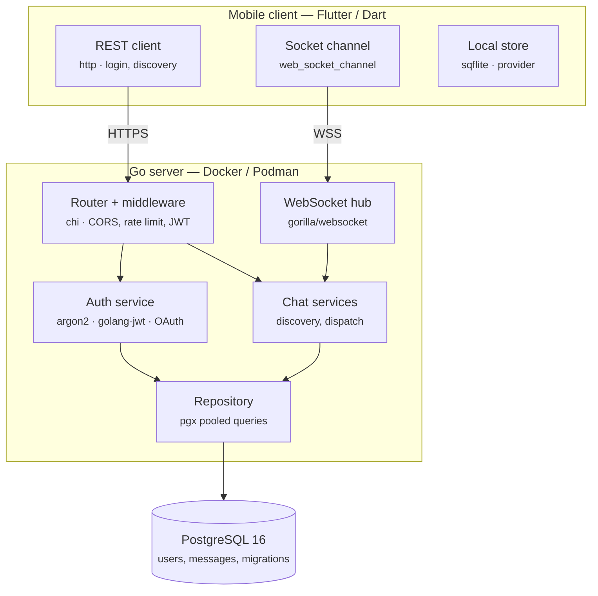
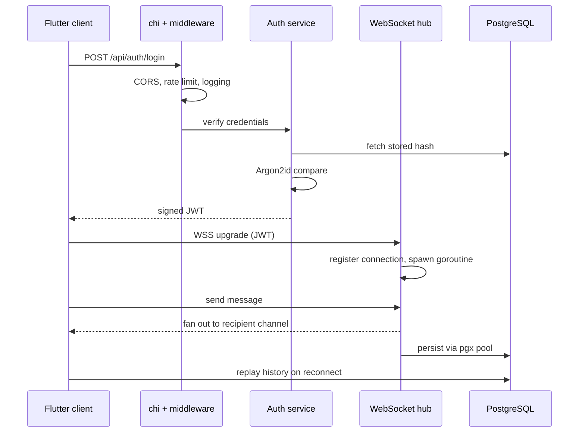

# Elephant — architecture

Real-time messaging built on Go, Flutter and PostgreSQL 16. This document describes the
runtime shape of the system and traces a single session end to end, from login through to a
persisted message.

Transport between client and server is TLS-protected. End-to-end encryption is not yet
implemented; the server can read message plaintext today.

---

## 1. The three tiers

**Mobile client — Flutter / Dart**

Three concerns, kept separate. The `http` package handles the request/response surface:
registration, login, OAuth callbacks and user discovery. `web_socket_channel` owns the single
long-lived connection that carries live messages. `sqflite` and `provider` hold local state, so
the UI has something to render before the socket reconnects.

**Go server — containerised**

`chi` handles routing and the middleware chain. A `gorilla/websocket` hub owns the set of
active connections. Underneath sit the service layer (auth, users, chat) and a repository layer
that talks to PostgreSQL through a `pgx` pool. The directory layout follows that split:
`routes/`, `middlewares/`, `controllers/`, `services/`, `repository/`, `models/`.

**PostgreSQL 16**

Reached only through the repository layer. The schema serves two opposing access patterns: a
write-heavy dispatch path on the hot side, and a read-heavy history path on reconnect.
Migrations live in `server/migrations/`.

---

## 2. Session flow, step by step

### Step 1 — the login request leaves the client

The client either posts credentials, or redirects into Google or GitHub OAuth and returns
through the configured callback URL.

One detail worth knowing before you debug a failed login: usernames are normalised to lowercase
and given a random four-digit discriminator at registration. Registering as `abc` may store
`abc.4821`. The discriminated name returned by the registration response is the one to log in
with.

### Step 2 — middleware runs before any handler

CORS, rate limiting, logging and, on protected routes, JWT verification. Rate limiting in front
of the auth endpoints matters more than it looks: an Argon2id verification is deliberately
expensive, so an unthrottled login endpoint is an easy way to burn server memory and CPU.

### Step 3 — credentials are verified and a token is issued

Argon2id compares the submitted password against the stored hash. The cost parameters are
configurable — memory, iterations and parallelism — and they are a real tradeoff rather than a
default to copy: raising them strengthens the hash and lengthens every login.

On success the auth service signs a JWT with the configured secret and returns it.

### Step 4 — the client stores the token and discovers users

Subsequent REST calls carry the JWT. Discovery results and message history land in the local
`sqflite` store so the app has state to render offline and on cold start.

### Step 5 — the connection upgrades to a WebSocket

The client opens a WSS connection. The hub authenticates the JWT, registers the connection
against the user, and spawns a goroutine to service it.

This is the design decision that shapes everything else. One goroutine per connection sounds
extravagant, but a goroutine starts at a few kilobytes of stack and the Go scheduler parks
blocked ones for free. Thousands of idle clients cost very little. The equivalent thread-per-
connection model would not survive the same load.

### Step 6 — a message fans out through channels

An inbound message reaches the hub, which looks up the recipient's registered connection and
writes to that connection's send channel. Each connection's writer goroutine drains its own
channel, so a slow client cannot block the hub or any other client.

### Step 7 — the message is persisted, then replayed later

The repository layer writes through the `pgx` pool. On reconnect, the client pulls history back
over REST and reconciles it against the local store.

---

## 3. Infrastructure

Fully containerised with Docker and Podman. `compose.yaml` pulls the published image;
`compose.dev.yaml` overrides it to build from `server/Dockerfile` so local changes take effect
immediately. GitHub Actions builds and publishes images to GHCR and Docker Hub, and attaches
Android APKs to GitHub Releases, on every version tag push.

Health check: `GET /api/health` reports Postgres reachability and a timestamp.

---

## 4. Mermaid sources

These render natively on GitHub, so they can live directly in `README.md`.

### Layered architecture

### Session flow

